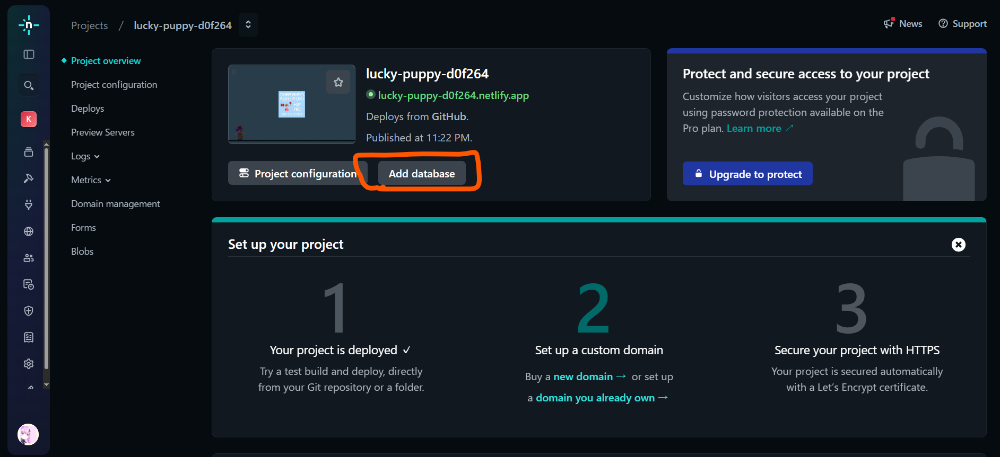
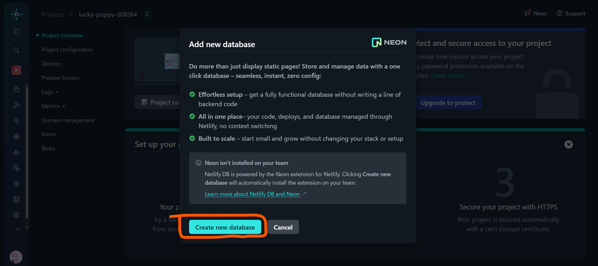
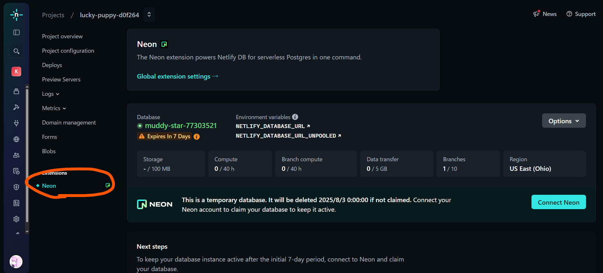
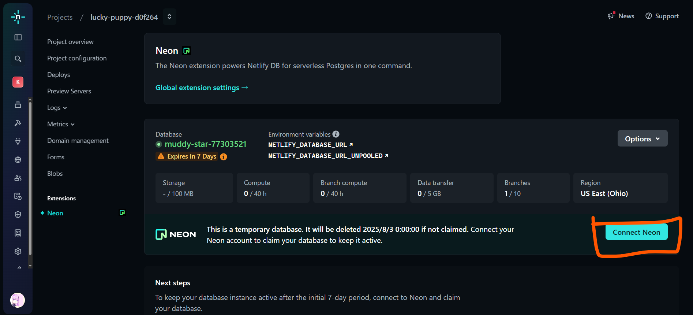
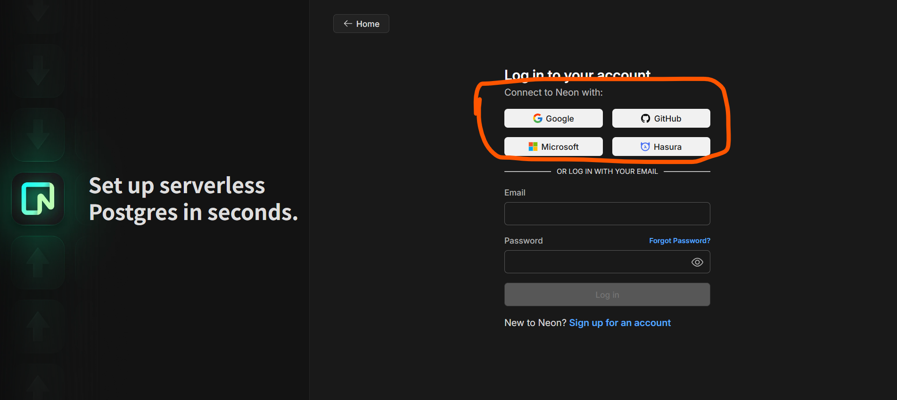
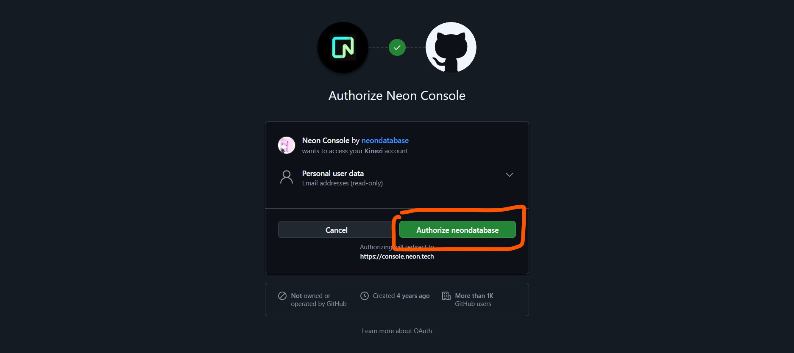
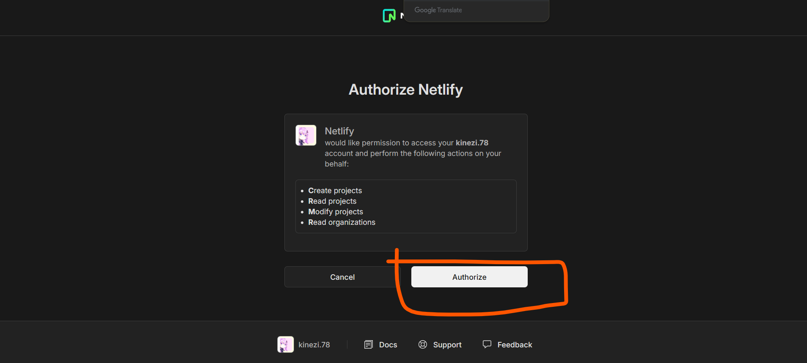
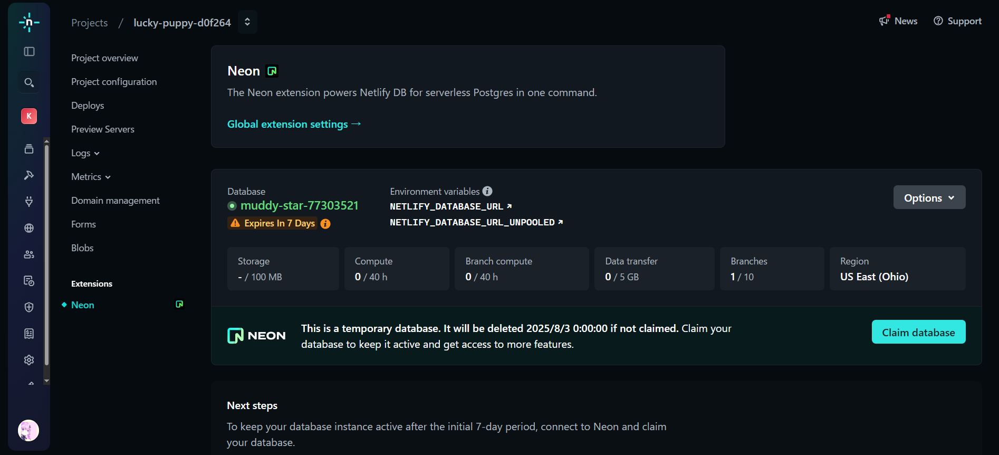
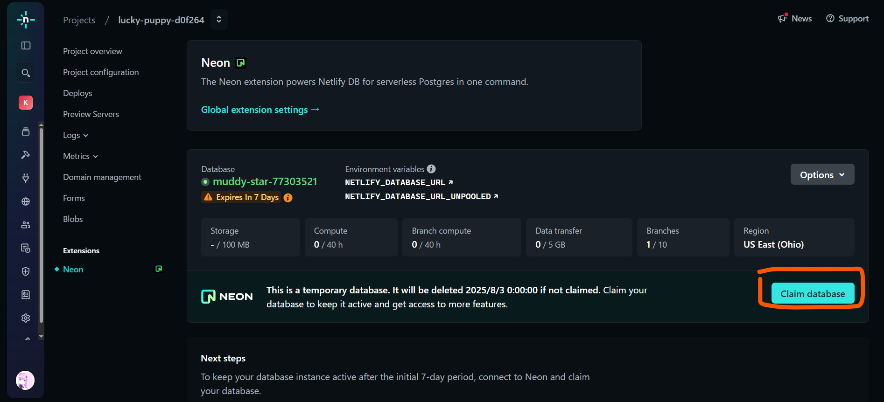
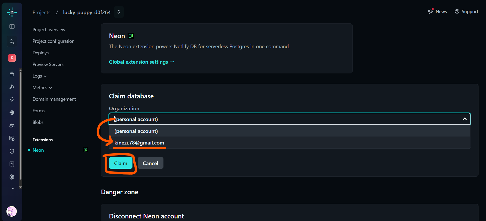

⚠️⚠️⚠️工事中⚠️⚠️⚠️

## 1. データベースを作る
1. Netlifyの「Project overview」画面で「Add database」をクリック
  

2. 「Create new database」をクリック
  

3. 「Project overview」画面に「Neon」タブが増えたらOK
  

## 2. Neonアカウントを作る
1. 「Connect Neon」ボタンをクリック
  

2. 好きなアカウントを連携する（私はGitHubを選びました）
  

3. 「Authorize neondatabase」をクリックする
  

4. 「Authorize」をクリックする
  

5. この画面に戻ってきたらOK
  

## 3. データベースの初期設定をする
1. 「Claim database」をクリック
  

2. 「(personal account)」をクリックして、自分のメールアドレスを選ぶ
  

